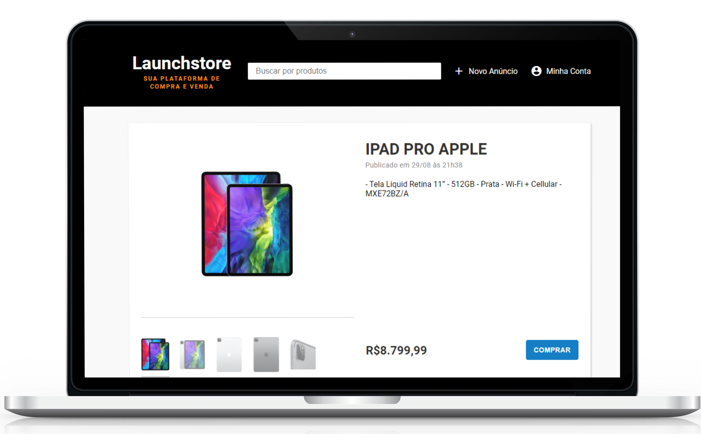

<h1 align="center">
  


<h2>  Projeto:</h2>

<p> Launchstore é uma plataforma de compra e venda de produtos. O projeto foi criado durante as aulas do bootcamp LaunchBase, da Rocketseat, visando a prática do <strong>Desenvolvimento Web FullStack</strong>.
<p><strong>Tecnologias utilizadas:</strong></p>
 <ul>
    <li>HTML</li>
    <li>CSS</li>
    <li>JavaScript</li>
    <li>NodeJS</li>
    <li>Express. </li> 
    <li>PostgreSQL</li>
    <li>Postbird</li>
</ul>

<strong>Objetivo:</strong>
<p> 
Praticar os conceitos de Back-End utilizando NodeJS, fazer criação de servidor, tratar dados de maneira dinâmica, fazer comunicação entre cliente e servidor, trabalhar com middlewares e rotas, etc; trabalhar com SQL utilizando o banco de dados PostgreSQL e Postbird.</p>
<p>
Praticar conceitos de Front-End utilizando HTML, CSS e JavaScript, para enviar dados através de formulários, fazer manipulação de elementos da DOM, manipulação de imagens, etc. 
</p>
<h2> 
Como utilizar:</h2>
<p> Você precisa instalar <a href="https://nodejs.org/en/">Node.js</a>, <a href="https://www.postgresql.org/">PostgreSQL</a> e o <a href="https://www.electronjs.org/apps/postbird">Postbird</a>. </p>
   
<h3> Passos <h3>
<h4> 1. Clonar repositório <h4>

```
 $ git clone https://github.com/viictorcamposs/launchstore
```

<h4> 2. Executar o aplicativo no seu terminal <h4>

<p> Adicione as credenciais de acesso ao banco de dados no arquivo src / app / config / db.js. </p>

```
#Instalar dependências
$ npm install

#Iniciar o servidor 
$ npm start

```
<h2> Resultado</h2>
<h3> Launchstore | Plataforma de compra e venda </h3>
